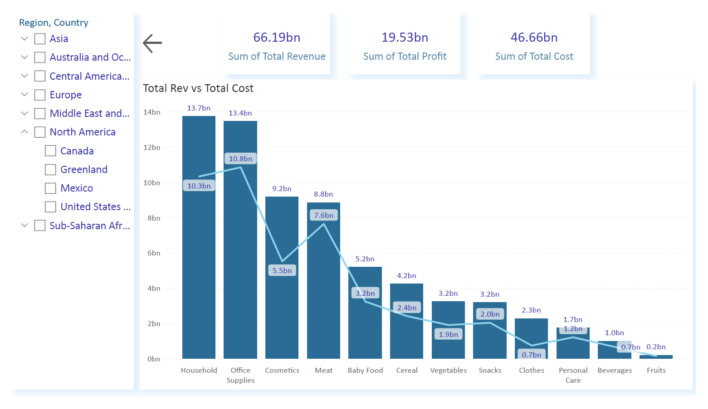
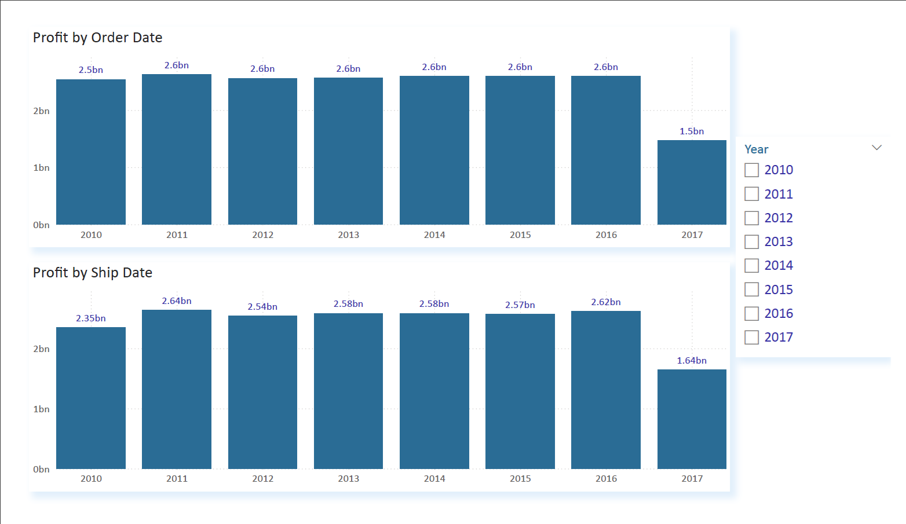
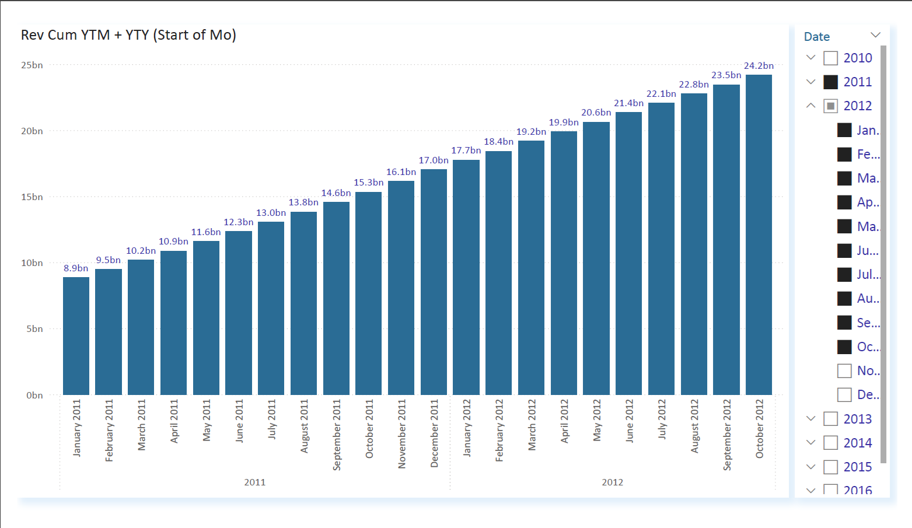
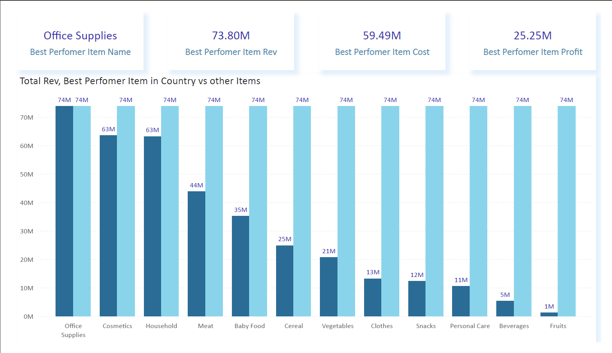

# Global Sales Analytics – Power BI Dashboard

Power BI dashboard analyzing global sales performance across regions, product categories, and time periods.  
The repository contains a portfolio preview of the report (PDF + screenshots).  
**The PBIX file is not included.**

## Contents
- `report_preview.pdf` – full-page preview of the dashboard  
- `screenshots/` – selected dashboard images  
- `Theme_used.json` – colour theme  
- `README.md` – project description

## Overview
This dashboard summarizes a multi-region sales dataset and highlights:

- Revenue, cost, and profit KPIs  
- Regional and country performance (Azure Maps)  
- Item-type contribution and category profitability  
- Online vs offline channel performance  
- Order Date vs Ship Date profit comparison  
- Cumulative revenue (YTM/YTY)  
- Short-term revenue forecasting  
- Best-performer logic for top-revenue items

## Analytical Features
- Time intelligence with DAX (YTD, YTY, same-period-last-year)  
- Cumulative calculations across multiple years  
- Best-performer identification using ranking logic  
- Forecasting using Power BI’s ETS model  
- Slicers for region, country, year, quarter, month  

## Data Model
- Fact table with transaction-level sales and financial metrics  
- Date table used for all time-based calculations  
- One active and one inactive relationship (OrderDate / ShipDate)
## Preview

### Overview

### Time Intelligence

### Cumulative Revenue

### Best Performer

